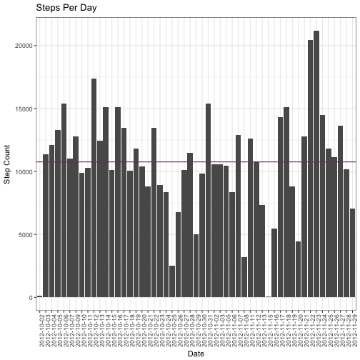
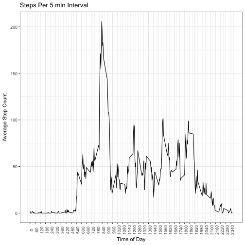
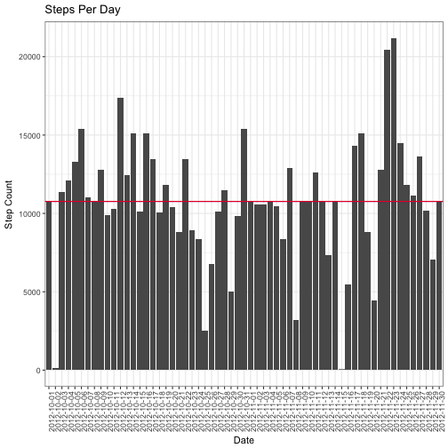
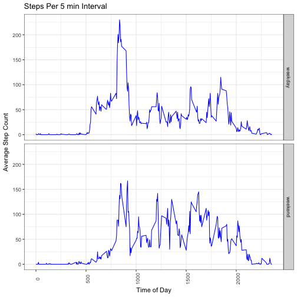

# Reproducible Research: Course Project 1


## Load and preprocess the data
##### 1. Load the data (i.e. read.csv())

```r
unzipFile <- "activity.csv"
downloadFile <- "activity.zip"

if(!file.exists(unzipFile)){
    unzip(downloadFile)
} else {
    
}
```

```
## NULL
```

```r
StepCountData <- read.csv(unzipFile)
```
##### 2. Process/transform the data (if necessary) into a format suitable for your analysis

```r
StepCountDataNotNA<-StepCountData[complete.cases(StepCountData),]
```

-----

## What is mean total number of steps taken per day?

```r
StepsPerDay <- aggregate(StepCountDataNotNA$steps,by=list(StepCountDataNotNA$date),FUN="sum")
names(StepsPerDay)<-c("interval","steps")
```

##### 1. Make a histogram of the total number of steps taken each day

```r
ggplot(StepsPerDay,aes(x=interval, y=steps))+
        geom_bar(stat="identity")+
        theme_bw()+
        theme(axis.text.x = element_text(angle = 90))+
        xlab("Date")+
        ylab("Step Count")+
        ggtitle("Steps Per Day")+
        geom_hline(yintercept = mean(StepsPerDay$steps), color="blue")+
        geom_hline(yintercept = median(StepsPerDay$steps), color="red")
```



##### 2. Calculate and report the mean and median total number of steps taken per day

```r
meanStepsByDay <- mean(StepsPerDay$steps)
medianStepsByDat <- median(StepsPerDay$steps)
```
* Mean: 1.0766189 &times; 10<sup>4</sup>
* Median:  10765

-----

## What is the average daily activity pattern?

```r
AverageStepsPerInterval <- aggregate(StepCountDataNotNA$steps,by=list(StepCountDataNotNA$interval),FUN="mean")
names(AverageStepsPerInterval)<-c("interval","steps")
AverageStepsPerInterval$steps<-round(AverageStepsPerInterval$steps)
```

##### 1. Make a time series plot

```r
ggplot(AverageStepsPerInterval, aes(x=interval, y=steps)) + 
        geom_line() + 
        theme_bw()+
        theme(axis.text.x = element_text(angle = 90))+
        xlab("Time of Day") + 
        ggtitle("Steps Per 5 min Interval")+
        ylab("Average Step Count")+
        scale_x_continuous(breaks = 
                    round(seq(min(AverageStepsPerInterval$interval), 
                    max(AverageStepsPerInterval$interval), by = 60),1)) 
```



##### 2. Which 5-minute interval, on average across all the days in the dataset, contains the maximum number of steps?

```r
mostStepTime <- AverageStepsPerInterval$interval[which.max(AverageStepsPerInterval$steps)]
```

* Most Steps at: 835

----

## Imputing missing values
##### 1. Calculate and report the total number of missing values in the dataset 

```r
countMissingValues <- nrow(StepCountData)-nrow(StepCountDataNotNA)
```

* Number of missing values: 2304

##### 2. Devise a strategy for filling in all of the missing values in the dataset.
##### 3. Create a new dataset that is equal to the original dataset but with the missing data filled in.

```r
StepCountDataNA <- StepCountData[!complete.cases(StepCountData),]
StepCountDataNA<-merge(x=StepCountDataNA, y=AverageStepsPerInterval,by=c("interval"),all.x = TRUE)
StepCountDataNA <- StepCountDataNA[,c("interval","date","steps.y")]       
names(StepCountDataNA)[3]<-"steps"
StepCountDataComplete <- rbind(StepCountDataNotNA,StepCountDataNA)
```


##### 4. Make a histogram of the total number of steps taken each day 

```r
StepsPerDayComplete <- aggregate(StepCountDataComplete$steps,by=list(StepCountDataComplete$date),FUN="sum")
    
names(StepsPerDayComplete)<-c("interval","steps")
    
ggplot(StepsPerDayComplete,aes(x=interval, y=steps))+
        geom_bar(stat="identity")+
        theme_bw()+
        theme(axis.text.x = element_text(angle = 90))+
        xlab("Date")+
        ylab("Step Count")+
        ggtitle("Steps Per Day")+
        geom_hline(yintercept = mean(StepsPerDayComplete$steps), color="blue")+
        geom_hline(yintercept = median(StepsPerDayComplete$steps), color="red")
```



##### ... and Calculate and report the mean and median total number of steps taken per day. 

```r
meanStepsByDayImputed <- mean(StepsPerDayComplete$steps)
medianStepsByDayImputed <- median(StepsPerDayComplete$steps)
```
* Mean (Imputed): 1.0765639 &times; 10<sup>4</sup>
* Median (Imputed):  1.0762 &times; 10<sup>4</sup>


----

## Are there differences in activity patterns between weekdays and weekends?
##### 1. Create a new factor variable in the dataset with two levels – “weekday” and “weekend” indicating whether a given date is a weekday or weekend day.


```r
StepCountDataComplete$wd<-weekdays(as.Date(StepCountDataComplete$date))
```

```
## Warning in strptime(xx, f <- "%Y-%m-%d", tz = "GMT"): unknown timezone
## 'default/Asia/Kolkata'
```

```r
StepCountDataComplete$we = factor(ifelse(StepCountDataComplete$wd %in% c("Saturday", 
         "Sunday"), "weekend", "weekday"))
```

##### 2. Make a panel plot containing a time series plot


```r
AverageStepsPerInterval <- aggregate(StepCountDataComplete$steps,
         by=list(StepCountDataComplete$interval,StepCountDataComplete$we),FUN="mean")
    
names(AverageStepsPerInterval)<-c("interval","we","steps")
    
AverageStepsPerInterval$steps <- round(AverageStepsPerInterval$steps)
    
ggplot(AverageStepsPerInterval, aes(x=interval, y=steps)) + 
        geom_line(color="blue") + 
        theme_bw()+
        theme(axis.text.x = element_text(angle = 90))+
        facet_grid(AverageStepsPerInterval$we~.)+
        xlab("Time of Day") + 
        ggtitle("Steps Per 5 min Interval")+
        ylab("Average Step Count")
```


